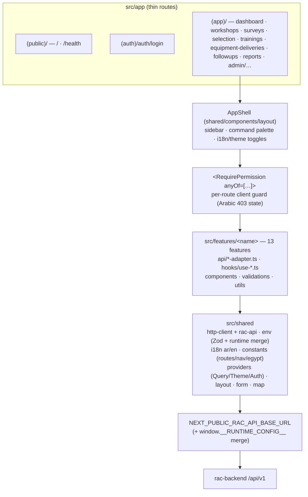
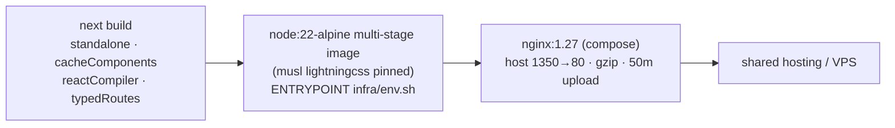

# RAC-DAMP Frontend

Next.js 16 frontend for the **RAC Digital Assessment & Monitoring Platform** — a bilingual
(Arabic RTL default / English LTR) M&E platform for a UNIDO/NOU/EED program supporting
Egypt's refrigeration & air-conditioning servicing sector. Consumes the
[ASP.NET Core 8 API](../rac-backend/README.md) under `/api/v1`.

Design system: [`../DESIGN.md`](../DESIGN.md) · Working guide: [`AGENTS.md`](./AGENTS.md) ·
Product scope: [`../CONTEXT.md`](../CONTEXT.md)

## Stack

| | |
|---|---|
| Framework | Next.js **16.3.5** (App Router, pinned) · React 19 · TypeScript 5 |
| Styling | Tailwind CSS v4 (PostCSS plugin, tokens in `globals.css`) · shadcn/ui (new-york) · Radix |
| Data | TanStack Query 5 · Axios · Zod (env + form schemas) |
| UI extras | Leaflet + react-leaflet 5 (OSM tiles) · Recharts · next-themes · sonner · lucide |
| Testing | Vitest 4 + Testing Library (jsdom) — 43 colocated test files |
| Delivery | `output: "standalone"` Docker image behind nginx · `cacheComponents` + `reactCompiler` + `typedRoutes` on |

## Architecture

Feature-first: routes are thin compositions, each domain owns its API/hooks/components,
and all cross-cutting infra lives in `shared/`. Features never import each other's
internals — cross-feature access goes through a feature's `index.ts`.



### Auth & session (client-side)

Bearer tokens in `localStorage` (deliberate — frontend and API live on different origins
under third-party-cookie blocking). No middleware; protection is layered:
per-route `RequirePermission`, permission-filtered sidebar, and a 401 interceptor.

```mermaid
sequenceDiagram
    participant U as Browser
    participant F as rac-frontend
    participant B as rac-backend
    U->>F: login (username/email + password)
    F->>B: POST /auth/login
    B-->>F: { accessToken, expiresAtUtc, user }
    F->>B: GET /auth/me (verify; 401→503 "server inconsistency")
    B-->>F: profile + effective permission keys
    F->>F: persist rac.session (localStorage) — legacy keys/cookies swept
    Note over F,B: every request: Bearer from rac.session (20s timeout,<br/>cold-start retry for idle hosted backend)
    B-->>F: 401 (expired/deactivated)
    F->>U: hard redirect /auth/login?next=… — session cleared
```

Permissions come from the backend matrix (`GET /auth/me`); SuperAdmin receives the `"*"`
wildcard, matched by the `can`/`canAny` helpers. Login is rate-limited server-side (429 aware).

### Data-fetching convention

Every feature follows the same pair: `api/<name>-adapter.ts` (typed calls through the
shared axios instance) + `hooks/use-<name>.ts` (TanStack Query wrapper — staleTime 30s,
retry 1). Responses normalize to a single `ApiError { message, status, code, data,
fieldErrors }`; ProblemDetails `errors` maps onto form fields via `field-errors.ts`.
File transfers (survey/training/delivery photos, report downloads) go through
`file-transfer.ts` (blob + progress).

### Bilingual by construction

`<html lang="ar" dir="rtl">` is server-rendered; the stored locale (cookie `rac_locale`)
applies post-hydration. ~1,230-line typed `ar`/`en` dictionaries — no i18n library;
`TranslationKey` derives from the Arabic source. Layout uses logical CSS properties
(`ms-*`/`me-*`, sidebar flips side with locale) and the **Cairo** font covers Arabic + Latin.

Design tokens live in `src/app/globals.css` (UNIDO palette: primary `#0072A8`, navy shell
`#004E77`, orange `#F58220` accents, purple `#7C4DBF` reserved for AI surfaces) mirroring
the workspace `DESIGN.md` / `tokens.json`. Status is never color-alone — badges carry text.

## Getting started

```bash
nvm use 22            # or Node ≥ 20.9.0
npm install
cp .env.example .env.local
npm run dev           # → http://localhost:3000 (Arabic RTL by default)
```

Point the API at your backend in `.env.local`:

```bash
NEXT_PUBLIC_RAC_API_BASE_URL=http://localhost:5161/api/v1
# production default ships in public/runtime-env.js (regenerated by infra/env.sh)
```

| Script | Purpose |
|---|---|
| `npm run dev` | Dev server |
| `npm run verify` | **lint + typecheck + vitest + production build** — run before handoff |
| `npm run lint` / `typecheck` / `test:run` | Individual gates (Husky pre-commit runs eslint) |
| `npm run corelia -- feature <name>` | Scaffold a new feature folder (refuses existing names) |

Environment is Zod-validated (`src/shared/config/env.ts`): build-time values win over
`window.__RUNTIME_CONFIG__` (loaded from `public/runtime-env.js` before hydration), so a
container restart can repoint the API without a rebuild.

## Testing

43 colocated `*.test.ts(x)` files with Vitest + Testing Library (jsdom): feature logic
(wizard navigation, filters, ranking math, duplicate handling, admin matrix/audit
rendering), component tests (login, dashboard, survey wizard stages), and shared-infra
tests (env merge logic, file transfer, nav permissions, i18n completeness, Zod schemas
including Arabic/emoji edge cases). `vitest.setup.ts` stubs `ResizeObserver` for Recharts.

## Build & deployment



`infra/env.sh` regenerates `public/runtime-env.js` from container env at every start.
`Make env|build|up|logs|push` wraps the workflow; `.gitlab-ci.yml` builds and pushes the
image on the default branch/tag.

> [!IMPORTANT]
> Next.js is **pinned to 16.3.5**: 16.3.6's Turbopack PostCSS worker fork dies on 1 GB
> shared hosts (`node process exited before connect`). Bump deliberately, with a deploy test.

## Layout

```
src/
  app/               thin routes — (public) (auth) (app) + api/health route handler
  components/ui/     23 shadcn/ui primitives
  features/          13 domain features (api · hooks · components · validations)
  shared/            http-client · rac-api · env · i18n · constants · providers · layout/form/map
  instrumentation*.ts server/client telemetry hooks
public/runtime-env.js  runtime env override (production)
```
